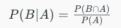
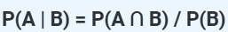

# **Machine Learning Cheat Sheet**

## **Preprocessing Techniques**

| **Technique**                         | **Description**                                                      | **Purpose**                                               | **Best Use-Cases**                                   | **Important Formula / Concept**                                 | **Major Libraries (Python)**                                  |                    |                                                                      |
| ------------------------------------- | -------------------------------------------------------------------- | --------------------------------------------------------- | ---------------------------------------------------- | --------------------------------------------------------------- | ------------------------------------------------------------- | ------------------ | -------------------------------------------------------------------- |
| **Standardization (Z-score Scaling)** | Scales features to have **mean = 0** and **std = 1**.                | Normalize feature ranges to improve ML model performance. | Logistic Regression, SVM, KNN, PCA.                  | 𝑧 = (𝑥 - μ) / σ                                               | `sklearn.preprocessing.StandardScaler`                        |                    |                                                                      |
| **Min-Max Scaling (Normalization)**   | Scales features to a fixed range, usually **\[0, 1]**.               | Brings all features to a uniform scale.                   | Neural networks, distance-based models (e.g., k-NN). | x\_scaled = (x - min) / (max - min)                             | `sklearn.preprocessing.MinMaxScaler`                          |                    |                                                                      |
| **Label Encoding**                    | Converts categorical text labels to integer codes.                   | Handle categorical variables for ML models.               | Ordinal categories (e.g., Low, Medium, High).        | Assign integer index to each unique category.                   | `sklearn.preprocessing.LabelEncoder`                          |                    |                                                                      |
| **One-Hot Encoding**                  | Converts categorical values to binary columns.                       | Handle nominal (unordered) categorical variables.         | Country names, product types.                        | \[0,1,0,...] vector representation for category.                | `sklearn.preprocessing.OneHotEncoder`, `pandas.get_dummies()` |                    |                                                                      |
| **Missing Value Imputation**          | Replaces missing data with mean, median, mode or model-based values. | Handle incomplete data for robust training.               | Medical datasets, survey data.                       | Mean: x̄ = ∑x/n; Median; Mode                                   | `sklearn.impute.SimpleImputer`, `pandas.fillna()`             |                    |                                                                      |
| **Outlier Handling**                  | Detects and removes or transforms extreme values.                    | Reduce model distortion from anomalies.                   | Financial fraud detection, sensor data cleaning.     | 𝑧 = (𝑥 - μ) / σ, IQR = Q3 - Q1                                                                                                                      | `scipy.stats.zscore`, `sklearn.preprocessing.RobustScaler`, `pandas` |
| **Feature Selection**                 | Selects most relevant features to reduce dimensionality.             | Improve model accuracy and reduce overfitting.            | Text classification, genomics.                       | Techniques: Chi-squared test, mutual information                | `sklearn.feature_selection`, `SelectKBest`, `RFE`             |                    |                                                                      |
| **Feature Extraction**                | Derives new features from existing ones.                             | Capture important characteristics in new form.            | Text mining (TF-IDF), image processing (HOG).        | TF-IDF = (Term Frequency) × log(1 + Inverse Document Frequency) | `sklearn.feature_extraction`, `TfidfVectorizer`               |                    |                                                                      |

## **Supervised Learning Algorithm**

| **Algorithm**                    | **Description**                                      | **Purpose**                                  | **Best Use-Cases**                         | **Important Formula**                                                                | **Major Libraries (Python)**                                                               |                   |                                                   |   |                                |
| -------------------------------- | ---------------------------------------------------- | -------------------------------------------- | ------------------------------------------ | ------------------------------------------------------------------------------------ | ------------------------------------------------------------------------------------------ | ----------------- | ------------------------------------------------- | - | ------------------------------ |
| **Linear Regression**            | Predicts continuous output based on input features.  | Predict continuous numerical outcomes.       | House prices, sales forecast.              | 𝑦 = 𝛽₀ + 𝛽₁𝑥₁ + ... + 𝛽ₙ𝑥ₙ                                                     | `sklearn.linear_model.LinearRegression`, `statsmodels`                                     |                   |                                                   |   |                                |
| **Logistic Regression**          | Predicts probability of class membership.            | Binary classification.                       | Spam detection, purchase prediction.       | 𝑝 = 1 / (1 + e^-(𝛽₀ + 𝛽₁𝑥₁ + ... + 𝛽ₙ𝑥ₙ))                                      | `sklearn.linear_model.LogisticRegression`, `statsmodels`                                   |                   |                                                   |   |                                |
| **Decision Tree**                | Splits data using features to form a tree structure. | Decision-based classification or regression. | Customer segmentation, medical diagnosis.  | Gini Index or Entropy for split: 𝐺 = 1 - ∑(pᵢ)²                                     | `sklearn.tree.DecisionTreeClassifier`, `DecisionTreeRegressor`                             |                   |                                                   |   |                                |
| **Random Forest**                | Combines multiple decision trees (ensemble).         | Higher accuracy, less overfitting.           | Credit scoring, stock prediction.          | Ensemble of trees with majority voting or averaging.                                 | `sklearn.ensemble.RandomForestClassifier`, `RandomForestRegressor`                         |                   |                                                   |   |                                |
| **Support Vector Machine (SVM)** | Finds optimal hyperplane between classes.            | Maximize class margin.                       | Image classification, OCR.                 | Decision function: f(x) = w·x + b; Margin =   | `sklearn.svm.SVC`, `LinearSVC` |
| **k-Nearest Neighbors (k-NN)**   | Predicts label by majority of k-nearest points.      | Instance-based classification.               | Recommendation systems, anomaly detection. | Distance metric: Euclidean (√∑(xᵢ - yᵢ)²)                                            | `sklearn.neighbors.KNeighborsClassifier`, `KNeighborsRegressor`                            |                   |                                                   |   |                                |
| **Naive Bayes**                  | Probabilistic classifier based on Bayes’ Theorem.    | Fast classification assuming independence.   | Email spam detection, sentiment analysis.  |  | `sklearn.naive_bayes.GaussianNB`, `MultinomialNB` |   |                                |
| **Ensemble Learning**            | Combines multiple models to improve performance.     | Boost accuracy and robustness.               | Fraud detection, large-scale prediction.   | Bagging (RF), Boosting (e.g., XGBoost): Final prediction = Weighted sum of learners | `sklearn.xgboost.XGBoost` |                   |                                                   |   |                                |

## **Unsupervised Learning Algorithm**

| **Algorithm**                          | **Description**                                                                   | **Purpose**                                  | **Best Use-Cases**                                           | **Important Formula / Concept**                                                                                                                    | **Major Libraries (Python)**                                    |
| -------------------------------------- | --------------------------------------------------------------------------------- | -------------------------------------------- | ------------------------------------------------------------ | -------------------------------------------------------------------------------------------------------------------------------------------------- | --------------------------------------------------------------- |
| **k-Means Clustering**                 | Partitions data into **k** clusters using distance to centroids.                  | Group similar data without labels.           | Market segmentation, document clustering, image compression. | - Distance: Euclidean ( √∑(xᵢ - μᵢ)² )    - Update Centroid: μ = mean of points in cluster   - Minimize Within-Cluster Sum of Squares (WCSS) | `sklearn.cluster.KMeans`                       |
| **Principal Component Analysis (PCA)** | Transforms original features into linearly uncorrelated **principal components**. | Reduce dimensions while preserving variance. | Image compression, noise reduction, feature extraction.      | - Covariance Matrix: Σ = (1/n)·XᵀX   - Eigen Decomposition: Σv = λv   - Principal Components = Top-k eigenvectors with highest eigenvalues   | `sklearn.decomposition.PCA` |

## **Recommender Systems**

| Algorithm               | Description                                                 | Purpose                            | Best Use-Cases                  | Important Formula / Concept                      | Major Libraries                            |
| ----------------------- | ----------------------------------------------------------- | ---------------------------------- | ------------------------------- | ------------------------------------------------ | ------------------------------------------ |
| Content-Based Filtering | Recommends items based on user’s history and item features. | Personalized recommendations       | Product or movie recommendation | Similarity = cosine(user\_profile, item\_vector) | `sklearn.metrics.pairwise`, `pandas`       |
| Collaborative Filtering | Uses user-item interaction matrix for prediction.           | Leverage behavior of similar users | E-commerce, social platforms    | Matrix Factorization: R ≈ U·Vᵀ                   | `Surprise`, `LightFM`, `scipy.sparse`      |
| Hybrid Recommendation   | Combines content-based and collaborative methods.           | Boost accuracy using both systems  | Netflix, Spotify, YouTube       | Weighted sum or model-based hybrid               | `LightFM`, `TensorFlow`, `scikit-surprise` |
